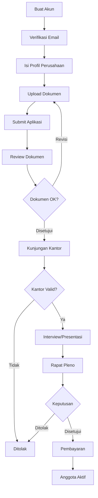

# Panduan Admin PERPI

Panduan visual untuk menggunakan sistem keanggotaan PERPI. Dokumentasi ini menunjukkan cara menggunakan setiap fitur dengan screenshot dan langkah-langkah visual.

## 🎯 Peran Admin

### 1. Leader (Pemimpin)
**Akses Penuh** - Dashboard: `/leader`

<!--  -->
*Screenshot: Dashboard Leader dengan akses penuh ke semua fitur*

**Fitur Utama**:
- ✅ User Management - Kelola akun admin
- ✅ Application Approval - Setujui/tolak aplikasi
- ✅ Plenary Decisions - Keputusan rapat pleno
- ✅ Full System Access

---

### 2. Committee (Komite)
**Peran Operasional** - Dashboard: `/committee`

<!--  -->
*Screenshot: Dashboard Committee dengan task list*

**Fitur Utama**:
- ✅ Review Applications - Review dokumen
- ✅ Office Visits - Kunjungan kantor
- ✅ Interviews - Wawancara
- ✅ Payment Management

---

### 3. Finance (Keuangan)
**Peran Keuangan** - Dashboard: `/finance`

<!--  -->
*Screenshot: Dashboard Finance dengan payment overview*

**Fitur Utama**:
- ✅ Invoice Management - Upload invoice
- ✅ Payment Verification - Verifikasi pembayaran
- ✅ Certificate Generation - Generate sertifikat
- ✅ Financial Reports

---

## 📚 Panduan Penggunaan

### 🚀 [Getting Started](./01-getting-started.md)
**Cara login dan navigasi dashboard**

<!--  -->

Pelajari cara:
- Login ke sistem
- Navigasi dashboard
- Menggunakan menu sidebar
- Logout dengan aman

---

### 👥 [User Management](../tutorial-autentikasi-perpi#pembuatan-pengguna-oleh-leader) *(Leader Only)*
**Cara membuat dan mengelola user**
Pelajari cara membuat akun Committee/Finance/Member

---

### 📋 [Application Management](./02-application-management.md) *(Leader & Committee)*
**Cara mengelola aplikasi keanggotaan**

Pelajari cara:
- Melihat daftar aplikasi
- Review dokumen
- Assign inspector/interviewer
- Request revisi

---

### 🏢 [Office Visit & Interview](./03-office-visit-interview.md) *(Leader & Committee)*
**Cara melakukan verifikasi lapangan**

Pelajari cara:
- Koordinasi jadwal kunjungan
- Upload foto dokumentasi
- Isi visit notes
- Submit hasil wawancara

---

### 🎪 [Plenary Meeting](./04-plenary-meeting.md) *(Leader & Committee)*
**Cara mengelola rapat pleno**

Pelajari cara:
- Jadwalkan rapat pleno
- Review hasil verifikasi
- Approve/reject aplikasi
- Request dokumen tambahan

---

### 💰 [Payment Management](./05-payment-management.md) *(Leader & Finance)*
**Cara mengelola pembayaran**

Pelajari cara:
- Upload invoice
- Verifikasi bukti bayar
- Generate sertifikat
- Track payment status

---

## 🔄 Alur Kerja Visual

---

## 📊 Akses Fitur Berdasarkan Peran

### Quick Reference:

| Fitur | Leader | Committee | Finance |
|-------|:------:|:---------:|:-------:|
| User Management | ✅ | ❌ | ❌ |
| Approve/Reject | ✅ | ❌ | ❌ |
| Review & Verify | ✅ | ✅ | ❌ |
| Payment & Invoice | ✅ | ✅ | ✅ |

---

## 📱 Navigasi Cepat

| Panduan | Untuk Siapa | Fitur Utama |
|---------|-------------|-------------|
| [🚀 Getting Started](./01-getting-started.md) | Semua | Login, Dashboard, Navigasi |
| [👥 User Management](../tutorial-autentikasi-perpi#pembuatan-pengguna-oleh-leader) | Leader | Buat & kelola user |
| [📋 Application Management](./02-application-management.md) | Leader & Committee | Review aplikasi |
| [🏢 Office Visit & Interview](./03-office-visit-interview.md) | Leader & Committee | Verifikasi lapangan |
| [🎪 Plenary Meeting](./04-plenary-meeting.md) | Leader & Committee | Keputusan akhir |
| [💰 Payment Management](./05-payment-management.md) | Finance, Leader & Committee | Kelola pembayaran |

---

**Selamat menggunakan sistem PERPI! 🎉**