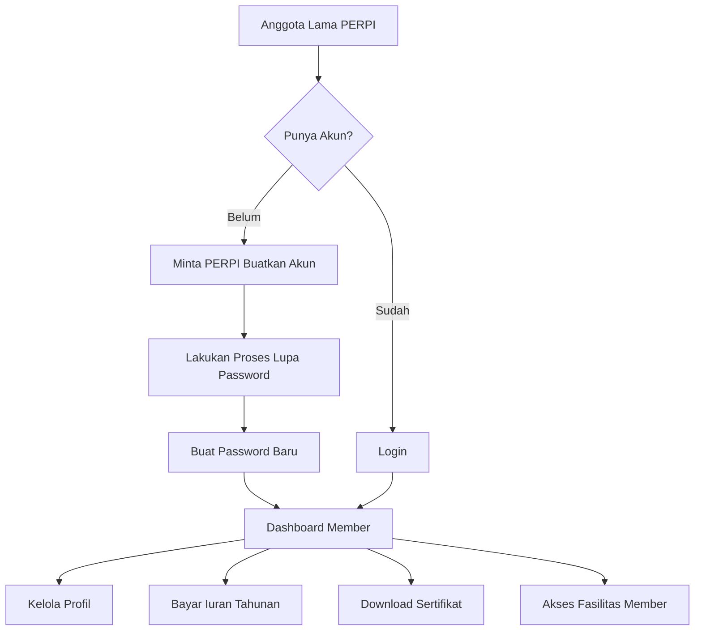

# Panduan Anggota PERPI

:::info Untuk Anggota yang Sudah Terdaftar
Panduan ini ditujukan untuk anggota PERPI yang sudah terdaftar dan ingin menggunakan sistem member management PERPI.
:::

## Selamat Datang!

Selamat datang di sistem member management PERPI! Panduan ini akan membantu Anda:
- Mengakses akun Anda untuk pertama kali
- Mengelola profil perusahaan
- Membayar iuran tahunan
- Mengunduh sertifikat keanggotaan
- Menggunakan fasilitas anggota

## Siapa yang Menggunakan Panduan Ini?

Panduan ini untuk Anda jika:
- ✅ Sudah menjadi anggota PERPI sebelumnya
- ✅ Belum memiliki akun di sistem baru
- ✅ Ingin mengakses dashboard member
- ✅ Perlu membayar iuran tahunan
- ✅ Ingin mengunduh sertifikat

:::warning Untuk Calon Anggota Baru
Jika Anda **belum** menjadi anggota PERPI dan ingin mendaftar, silakan lihat [Panduan Pendaftaran Anggota Baru](../new-member-guide/README.md).
:::

## Gambaran Umum Sistem

### Apa itu Sistem Member Management PERPI?

Sistem ini adalah platform digital untuk:
- **Manajemen Keanggotaan**: Kelola data dan status keanggotaan
- **Pembayaran Iuran**: Bayar dan lacak iuran tahunan
- **Sertifikat Digital**: Unduh sertifikat keanggotaan
- **Fasilitas Member**: Akses berbagai fasilitas eksklusif anggota
- **Direktori Anggota**: Lihat profil anggota PERPI lainnya

### Keuntungan Menggunakan Sistem

- 🚀 **Akses 24/7**: Kelola keanggotaan kapan saja, di mana saja
- 💳 **Pembayaran Mudah**: Upload bukti transfer dan lacak status pembayaran
- 📜 **Sertifikat Digital**: Download sertifikat kapan saja
- 🔄 **Update Real-time**: Informasi keanggotaan selalu up-to-date
- 🤝 **Networking**: Akses direktori anggota untuk kolaborasi

## Alur Penggunaan Sistem

## 🔐 Autentikasi dan Akun

Untuk panduan login, reset password, dan manajemen akun, silakan baca:

**📖 [Panduan Autentikasi](../tutorial-autentikasi-perpi.md)**

Panduan autentikasi mencakup:
- Login ke sistem
- Reset password (lupa password)
- Update password dari dashboard
- Keamanan akun

:::info Belum Punya Akun?
Jika Anda adalah anggota lama yang belum memiliki akun, hubungi Leader PERPI untuk dibuatkan akun. Lihat panduan autentikasi untuk detail lebih lanjut.
:::

---

## Panduan Fitur Member

### 1️⃣ Pembayaran Iuran Tahunan

Cara membayar iuran tahunan dan upload bukti transfer:

➡️ **[Panduan Pembayaran Iuran](./01-annual-payment.md)**

**Topik yang Dibahas**:
- Melihat status iuran tahunan
- Informasi pembayaran
- Upload bukti transfer
- Tracking verifikasi pembayaran
- Perpanjangan keanggotaan

**Estimasi Waktu**: 15-30 menit (untuk pembayaran)

**Biaya**: Rp 5.000.000 per tahun

---

### 2️⃣ Sertifikat Keanggotaan

Cara melihat dan mengunduh sertifikat keanggotaan:

➡️ **[Panduan Sertifikat](./02-certificates.md)**

**Topik yang Dibahas**:
- Melihat sertifikat yang tersedia
- Download sertifikat digital (PDF)
- Verifikasi sertifikat
- Sertifikat untuk setiap tahun

**Estimasi Waktu**: 5 menit

---

## Status Keanggotaan

### Jenis Status

| Status | Deskripsi | Akses |
|--------|-----------|-------|
| **Active Member** | Anggota aktif dengan iuran terbayar | ✅ Akses penuh semua fitur |
| **Inactive Member** | Anggota dengan iuran belum dibayar | ⚠️ Akses terbatas |
| **Applicant** | Sedang dalam proses aplikasi | 📝 Akses aplikasi saja |

### Perpanjangan Keanggotaan

- **Periode**: 1 tahun dari tanggal pembayaran
- **Iuran Tahunan**: Rp 5.000.000
- **Reminder**: 4 minggu sebelum expired

## Fitur Utama Sistem

### 1. Dashboard Member
- Overview status keanggotaan
- Informasi iuran tahunan
- Quick access ke fitur-fitur utama

### 2. Profil Perusahaan
- Edit informasi perusahaan
- Update kontak dan alamat
- Kelola data operasional
- Profil publik di direktori

### 3. Pembayaran
- Lihat riwayat pembayaran
- Upload bukti transfer
- Track status verifikasi
- Request invoice

### 4. Sertifikat
- Download sertifikat digital
- Lihat riwayat sertifikat
- Verifikasi sertifikat

## FAQ - Pertanyaan Umum

### Akun dan Login

**Q: Saya anggota lama, bagaimana cara mendapat akun?**
A: Hubungi PERPI untuk meminta dibuatkan akun.

**Q: Saya lupa password, bagaimana?**
A: Gunakan fitur "Lupa Password" di halaman login. Lihat [Panduan Reset Password](../tutorial-autentikasi-perpi#lupa-password).

**Q: Apakah bisa ganti email?**
A: Ya, hubungi admin PERPI untuk mengganti email yang terdaftar.

### Pembayaran

**Q: Berapa iuran tahunan PERPI?**
A: Rp 5.000.000 per tahun (untuk anggota yang sudah terdaftar).

**Q: Bagaimana cara bayar iuran?**
A: Transfer ke rekening PERPI, lalu upload bukti transfer di dashboard. Lihat [Panduan Pembayaran](./01-annual-payment.md).

**Q: Berapa lama verifikasi pembayaran?**
A: Biasanya 1-3 hari kerja setelah upload bukti transfer.

**Q: Apa yang terjadi jika telat bayar?**
A: Ada grace period 1 bulan. Setelah itu status menjadi inactive dan akses dibatasi.

### Sertifikat

**Q: Bagaimana cara download sertifikat?**
A: Login ke dashboard, masuk ke menu Pembayaran atau Fasilitas, lalu klik download. Lihat [Panduan Sertifikat](./02-certificates.md).

**Q: Apakah sertifikat untuk setiap tahun?**
A: Ya, setiap tahun setelah pembayaran dikonfirmasi, sertifikat baru akan diterbitkan.

**Q: Sertifikat belum tersedia, kenapa?**
A: Sertifikat dibuat setelah pembayaran diverifikasi. Jika sudah lebih dari 7 hari, hubungi PERPI.

### Status Keanggotaan

**Q: Bagaimana cara cek status keanggotaan?**
A: Login ke dashboard, status akan terlihat di header dan halaman profil.

**Q: Kapan harus perpanjang keanggotaan?**
A: Sebelum periode keanggotaan berakhir. Anda akan menerima reminder via email.

**Q: Bisa reaktivasi jika sudah inactive?**
A: Ya, dengan membayar iuran yang tertunggak. Hubungi PERPI untuk detail.

## Keamanan dan Privasi

### Keamanan Akun

- ✅ Password terenkripsi
- ✅ Session management yang aman
- ✅ HTTPS untuk semua koneksi
- ✅ Email verification untuk reset password

### Privasi Data

- 🔒 Data perusahaan hanya visible untuk anggota
- 🔒 Informasi finansial dijaga kerahasiaannya
- 🔒 Tidak ada sharing data ke pihak ketiga
- 🔒 Sesuai dengan regulasi privasi data

:::info Feedback
Kami sangat menghargai feedback Anda untuk perbaikan sistem dan dokumentasi ini.
:::

