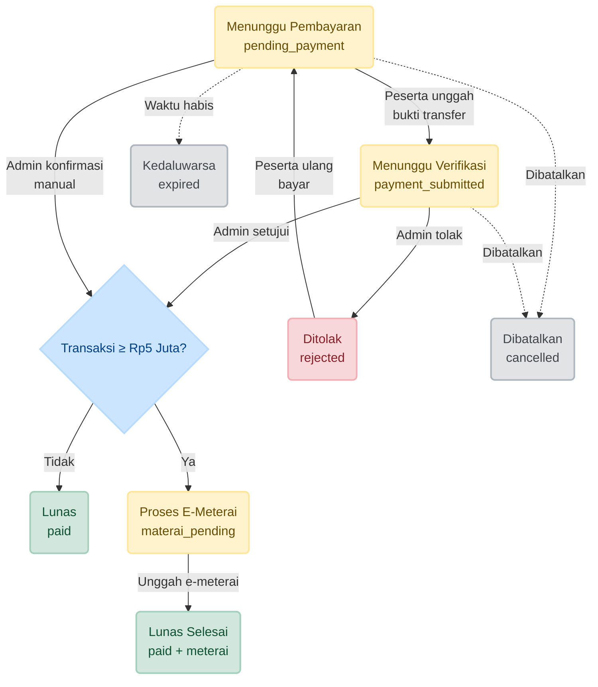
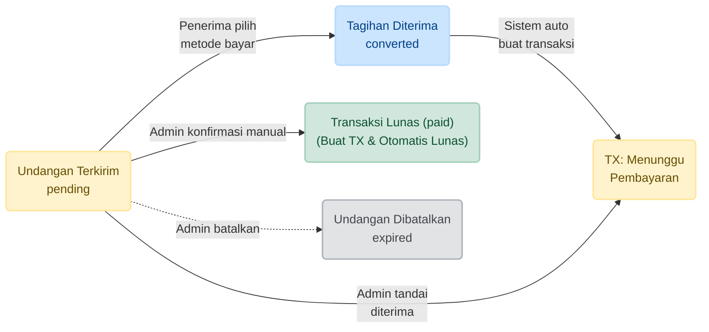

Pembaruan ini memperkenalkan tampilan **Payment Page baru** yang memusatkan `Event Transaction` dan `Billing Intent` ke dalam **satu tabel terpadu**. Tujuannya adalah agar admin dapat mengelola dan memantau seluruh alur pembayaran — mulai dari tagihan hingga transaksi selesai — dalam satu halaman, dengan action button yang muncul secara dinamis sesuai state setiap baris.

## ℹ️ Informasi Rilis

| Informasi         | Detail                               |
| :---------------- | :----------------------------------- |
| **Tanggal Rilis** | Senin, 4 Mei 2026                    |
| **Status**        | ✅ Deployed (Production)             |
| **Tipe Update**   | Feature Enhancement & UX Improvement |

---

### 1. Latar Belakang Perubahan

Sebelumnya, transaksi dan tagihan dikelola di tempat-tempat terpisah. Admin harus berpindah halaman untuk mengecek status tagihan terkirim, memverifikasi bukti transfer, atau melihat billing intent yang belum direspons. Hal ini memperlambat proses verifikasi dan meningkatkan risiko terlewatnya transaksi yang butuh perhatian.

  

    <h4>🚫 Sebelum — Data Terpisah</h4>
    <ul>
      <li>Transaksi tiket dan billing intent berada di halaman atau section yang berbeda.</li>
      <li>Tidak ada indikator pusat untuk melihat jumlah pembayaran yang menunggu verifikasi.</li>
      <li>Admin harus ingat status masing-masing record secara terpisah.</li>
    </ul>
  

  

    <h4>✅ Sesudah — Satu Tabel Terpadu</h4>
    <ul>
      <li>Seluruh <em>transaction</em> dan <em>billing intent</em> muncul dalam satu tabel yang sama.</li>
      <li>Statistik total (Lunas, Menunggu, Billing Intent, Estimasi Pendapatan) tersedia di bagian atas secara real-time.</li>
      <li>Filter dan pencarian terintegrasi: event, status transaksi, status tagihan, hingga pencarian invoice/nama/email.</li>
    </ul>
  

  

    
  

  

    
Tampilan utama halaman <strong>Kelola Pembayaran</strong> dengan statistik di atas, filter status, pencarian, dan tabel terpadu TX + BI.

  

---

### 2. Struktur Tabel & Badge Status

Setiap baris memiliki badge status yang **bersatu** antara transaksi dan billing intent:

| Badge  | Deskripsi                                                                                      |
| :----- | :--------------------------------------------------------------------------------------------- |
| **TX** | <em>Transaction</em> — catatan pembayaran langsung dari peserta.                               |
| **BI** | <em>Billing Intent</em> — tagihan yang dikirim ke penerima undangan (belum menjadi transaksi). |

Status masing-masing ditampilkan dengan **warna dan ikon yang konsisten** sehingga admin bisa membedakan tingkat urgensi dengan sekali lihat.

:::info Status Urgensi
Baris dengan status **Menunggu Verifikasi** (`payment_submitted`) akan ditandai dengan ikon peringatan (🔔) dan highlight indigo agar admin langsung menyadari adanya bukti transfer yang perlu ditinjau.
:::

---

### 3. Action Button Berbasis State

Tombol aksi tidak muncul semuanya sekaligus — hanya tampil sesuai **state dan tipe baris** yang aktif. Berikut rincian seluruh aksi yang tersedia.

#### A. Aksi pada Transaksi (TX)

| State / Kondisi                    | Aksi yang Tersedia                            | Fungsi                                                                   |
| :--------------------------------- | :-------------------------------------------- | :----------------------------------------------------------------------- |
| Semua TX                           | **Lihat Detail**                              | Membuka modal ringkasan transaksi                                        |
| `payment_submitted`                | **Setujui Pembayaran**                        | Konfirmasi bukti transfer valid; transaksi jadi _Lunas_                  |
| `payment_submitted`                | **Tolak Pembayaran**                          | Menolak bukti transfer dengan wajib mengisi alasan                       |
| `pending_payment`                  | **Konfirmasi Lunas**                          | Upload bukti transfer manual oleh admin untuk menandai lunas             |
| `pending_payment` (ada DOKU)       | **Salin Tautan Pembayaran**                   | Menyalin link DOKU + rekening fallback ke clipboard                      |
| `pending_payment` (belum ada DOKU) | **Generate DOKU Order**                       | Membuat tautan pembayaran baru via DOKU                                  |
| `pending_payment` (metode gateway) | **Cek Status Pembayaran**                     | Menanyakan ulang status ke gateway DOKU                                  |
| `materai_pending`                  | **Unduh Templat Kuitansi**                    | Mengunduh PDF kuitansi sebagai dasar tanda tangan e-meterai              |
| `materai_pending`                  | **Unggah E-Meterai**                          | Mengunggah dokumen tanda tangan elektronik untuk menyelesaikan transaksi |
| Dokumen tersedia                   | **Lihat Invoice / Kuitansi / Bukti Transfer** | Mengunduh atau membuka dokumen terkait baris                             |

  

    

      

        
      

      

        
<strong>Menu Aksi — Transaction</strong> Tombol aksi muncul sesuai state TX aktif. Contoh di atas menunjukkan status <em>Menunggu Verifikasi</em> dengan opsi Setujui / Tolak.

      

    

  

  

    

      

        
      

      

        
<strong>Menu Aksi — Billing Intent</strong> Billing Intent yang masih pending menampilkan opsi konfirmasi manual, tandai diterima, dan batalkan tagihan.

      

    

  

#### B. Aksi pada Billing Intent (BI)

| State / Kondisi               | Aksi yang Tersedia   | Fungsi                                                                                 |
| :---------------------------- | :------------------- | :------------------------------------------------------------------------------------- |
| Semua BI                      | **Lihat Detail**     | Membuka modal ringkasan billing intent                                                 |
| `pending` & belum kedaluwarsa | **Konfirmasi Lunas** | Menandai tagihan sebagai lunas tanpa perlu penerima membayar                           |
| `pending` & belum kedaluwarsa | **Tandai Diterima**  | Mengkonversi billing intent menjadi transaksi baru dengan status _Menunggu Pembayaran_ |
| `pending` & belum kedaluwarsa | **Batalkan Tagihan** | Membatalkan undangan; slot peserta akan dibebaskan                                     |

  

    

      

        
      

      

        
<strong>Modal Detail</strong> Menampilkan seluruh informasi baris: data peserta, event dan riwayat status.

      

    

  

  

    

      

        
      

      

        
<strong>Konfirmasi Manual</strong> Dialog unggah bukti transfer untuk menandai transaksi atau billing intent sebagai lunas secara admin.

      

    

  

---

### 4. Panduan Status & Alur (Status Legend)

Tabel dilengkapi dengan **panduan status** yang bisa dibuka dan ditutup. Panduan ini menjelaskan:

- **Status Transaksi (TX)** — mulai dari _Menunggu Pembayaran_ hingga _Kedaluwarsa_.
- **Alur TX** — visual alur state normal dari tagihan hingga lunas (termasuk cabang _E-Meterai_ jika ≥ Rp5 juta).
- **Status Billing Intent (BI)** — mulai dari _Undangan Terkirim_ hingga _Undangan Dibatalkan_.
- **Alur BI** — visual alur konversi dari undangan ke transaksi.

Tombol ini membantu admin baru memahami sistem tanpa harus bertanya ke tim teknis.

  

    
  

  

    
<strong>Panduan Status &amp; Alur (Status Legend)</strong> Panel yang bisa di-expand untuk melihat penjelasan setiap status TX dan BI beserta alur state-nya.

  

---

### 5. Ringkasan Statistik

Empat kartu statistik muncul di bagian atas tabel:

1. **Lunas (Paid)** — total nilai transaksi yang sudah dikonfirmasi lunas.
2. **Menunggu Pembayaran** — total nilai transaksi yang belum dibayar.
3. **Pending Billing Intent** — total nilai tagihan yang masih menunggu respons.
4. **Estimasi Pendapatan** — total seluruh nilai transaksi + billing intent.

  

    
  

  

    
<strong>Ringkasan Statistik</strong> Empat kartu di atas tabel menampilkan total Lunas, Menunggu Pembayaran, Pending Billing Intent, dan Estimasi Pendapatan secara real-time.

  

---

### 6. Diagram Alur (Flowchart)

Berikut visualisasi alur status menggunakan diagram Mermaid agar lebih mudah dipahami.

#### A. Alur Transaction (TX)

:::tip Interpretasi
Alur utama bergerak dari kiri ke kanan. Garis dari `PA` ke `MP` hanya muncul jika nilai transaksi **≥ Rp5 juta**. Dari `rejected`, peserta masih bisa kembali ke `pending_payment` untuk mengunggah bukti baru.
:::

#### B. Alur Billing Intent (BI)

:::tip Interpretasi
Billing Intent adalah "pra-transaksi". Begitu penerima merespons atau admin bertindak, BI akan dikonversi menjadi transaksi nyata atau langsung dinyatakan lunas.
:::

---

## 📖 Glosarium

Berikut istilah-istilah teknis yang digunakan dalam tampilan ini:

| Istilah                        | Penjelasan                                                                                                                       |
| :----------------------------- | :------------------------------------------------------------------------------------------------------------------------------- |
| **TX**                         | Singkatan dari _Transaction_ — catatan pembayaran aktual yang dilakukan oleh peserta.                                            |
| **BI**                         | Singkatan dari _Billing Intent_ — rencana tagihan yang dikirim ke calon peserta melalui undangan; belum menjadi transaksi nyata. |
| **DOKU**                       | Payment gateway asal Indonesia yang digunakan untuk membuat tautan pembayaran digital.                                           |
| **E-Meterai**                  | Tanda tangan elektronik resmi (meterai digital) yang diwajibkan untuk transaksi bernilai ≥ Rp5 juta sesuai regulasi.             |
| **Billing Intent → Transaksi** | Proses konversi di mana penerima undangan memilih metode bayar, sehingga sistem otomatis mencatatkan transaksi baru.             |
| **Konfirmasi Manual**          | Proses di mana admin mengunggah bukti transfer atas nama peserta untuk menandai transaksi lunas secara manual.                   |
| **Payment Submitted**          | Status TX yang menandakan peserta sudah mengunggah bukti transfer dan sedang menunggu tinjauan admin.                            |
| **Materai Pending**            | Status TX yang menandakan pembayaran sudah lunas tetapi transaksi masih menunggu unggahan dokumen e-meterai.                     |
