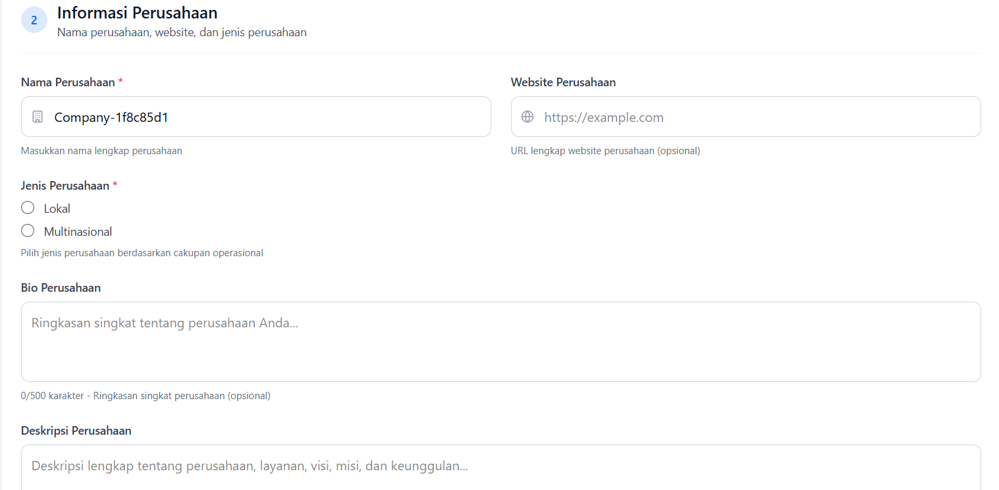

# 1. Pengisian Profil Perusahaan

:::warning Pastikan Anda Telah Membuat Akun
Sebelum melengkapi profil perusahaan, pastikan Anda sudah membuat akun dan login ke sistem. Jika belum, silakan baca terlebih dahulu: **[📖 Panduan Autentikasi](../tutorial-autentikasi-perpi.md)**
:::

## Gambaran Umum

Profil perusahaan adalah informasi lengkap tentang perusahaan Anda yang akan direview oleh tim PERPI. Informasi ini mencakup:

- Data perusahaan (nama, alamat, kontak)
- Informasi PIC (Person in Charge)
- Detail operasional (tahun berdiri, jumlah karyawan, dll)
- Informasi keuangan (revenue range)

**Estimasi Waktu**: 30-45 menit

**Status Aplikasi**: `Mengisi Profil` → `Mengisi Dokumen`

## Persiapan Data

Sebelum mulai mengisi form, siapkan informasi berikut:

### Dokumen Referensi
- [ ] Akta Pendirian Perusahaan
- [ ] NPWP Perusahaan
- [ ] NIB (Nomor Induk Berusaha)
- [ ] Surat Domisili
- [ ] Kartu identitas PIC

### Informasi yang Diperlukan
- [ ] Data lengkap perusahaan
- [ ] Alamat kantor yang detail
- [ ] Nomor telepon kantor yang aktif
- [ ] Data PIC yang akan menjadi contact person
- [ ] Informasi operasional perusahaan

## Langkah 1: Akses Form Profil Perusahaan

### Cara Mengakses

Setelah login pertama kali, Anda akan otomatis diarahkan ke halaman aplikasi:

1. **URL**: `/applications/[companyId]`
2. **Navigasi**: Dashboard → Tab "Informasi Perusahaan"


### Tampilan Awal

Anda akan melihat:
1. Header aplikasi yang berisi data perusahaan di bagian kiri, dan informasi aplikasi di sebelah kanan
2. Progress bar beserta tab yang menunjakan langkah-langkah aplikasi.

Jika anda scroll kebawah anda akan melihat form data perusahaan


## Langkah 2: Isi Data PIC (Person in Charge)

### Section: Informasi PIC


PIC adalah orang yang bertanggung jawab dan menjadi contact person utama.

#### 1. Nama Lengkap PIC
- **Validasi**: 
  - Minimal 2 karakter
  - Maksimal 255 karakter
- **Contoh**: "Budi Santoso"

:::warning Penting
Nama PIC akan digunakan dalam semua komunikasi resmi. Pastikan menggunakan nama lengkap yang sesuai dengan identitas.
:::

#### 2. Nomor Telepon PIC
- **Format**: 
  - `08xxxxxxxxxx` (format Indonesia)
  - `+628xxxxxxxxxx` (format internasional)
  - `628xxxxxxxxxx` (tanpa +)
- **Validasi**: Harus nomor yang valid dan aktif
- **Contoh**: "081234567890"

:::tip Tips
- Gunakan nomor yang aktif dan sering digunakan
- Pastikan nomor bisa dihubungi via WhatsApp
- Nomor ini akan digunakan untuk koordinasi kunjungan dan interview
:::

#### 3. Jenis Perusahaan
- **Format**: Single select dropdown
- **Opsi**: Lokal atau Multinational
- **Contoh**: "Lokal"

#### Bio dan Deskripsi Perusahaan (Opsional)
- **Format**: Teks panjang

## Langkah 3: Isi Data Perusahaan

### Section: Informasi Perusahaan


#### 1. Nama Perusahaan
- **Format**: Nama resmi perusahaan
- **Validasi**: 
  - Minimal 2 karakter
  - Maksimal 255 karakter
- **Contoh**: "PT Riset Pasar Indonesia"

:::info Catatan
Gunakan nama resmi sesuai akta pendirian. Nama ini akan muncul di sertifikat keanggotaan.
:::

#### 2. Website Perusahaan
- **Format**: URL lengkap
- **Validasi**: Harus diawali dengan "https://"
- **Contoh**: "https://www.example.com"

:::info Catatan
Website akan ditampilkan di profil perusahaan. Pastikan:
- URL aktif
- Website profesional
- Informasi perusahaan lengkap
:::

## Langkah 4: Isi Alamat Kantor
### Section: Alamat Kantor


:::warning Penting
Alamat ini akan diverifikasi melalui kunjungan kantor. Pastikan:
- Alamat lengkap dan akurat
- Mudah ditemukan
- Sesuai dengan surat domisili
- Kantor benar-benar operasional di alamat tersebut
:::

:::tip Tips
Anda dapat menggunakan search bar ***Cari Lokasi Perusahaan*** untuk autofill alamat.
:::

#### 1. Alamat Jalan
- **Validasi**: Minimal 10 karakter
- **Contoh**: 
  ```
  Jl. Sudirman No. 123, Lantai 5
  Gedung Perkantoran ABC
  ```

#### 3. Kota
- **Format**: Nama kota
- **Validasi**: Minimal 2 karakter
- **Contoh**: "Jakarta Pusat"

#### 4. Provinsi
- **Format**: Nama provinsi 
- **Validasi**: Minimal 2 karakter
- **Contoh**: "DKI Jakarta"

#### 5. Kode Pos
- **Format**: 5 digit angka
- **Validasi**: Harus 5 digit
- **Contoh**: "10250"


## Langkah 5: Isi Data Operasional

Informasi lengkap tentang layanan, sumber daya manusia, dan keuangan perusahaan

---

#### A. Section: Layanan dan Teknologi


##### 1. Industri yang Didukung *
- **Format**: Single select dropdown
- **Opsi**:
  - Pertanian
  - Pakaian & Mode
  - Otomotif
  - Minuman (Alkohol / Non-Alkohol)
  - Konstruksi
  - E-Commerce
  - Pendidikan
  - Hiburan
  - Fast-Moving Consumer Goods (FMCG)
  - Keuangan
  - Pemerintah
  - Kesehatan
  - Peralatan Rumah Tangga
  - Media
  - Perawatan Pribadi & Kecantikan
  - Sektor publik / Lembaga Non Profit (NGO)
  - Agensi riset
  - Ritel (Offline & Online)
  - Teknologi
  - Telekomunikasi
  - Perjalanan
  - Lainnya

:::tip Tips Memilih Industri
Pilih industri utama yang menjadi fokus atau spesialisasi perusahaan riset Anda. Ini membantu PERPI memahami expertise area Anda.
:::

---

#### B. Section: Sumber Daya Manusia

##### 1. Jenis Karyawan *
- **Format**: Multi select (checkbox)
- **Opsi**:
  - Full-time
  - Part-time
  - Freelancer
- **Deskripsi**: Pilih jenis karyawan yang ada di perusahaan

:::info Catatan
Anda dapat memilih lebih dari satu jenis karyawan sesuai dengan komposisi tim perusahaan.
:::

##### 2. Jenis Tim Operasional
- **Format**: Multi select (checkbox)
- **Opsi**:
  - Full-time
  - Part-time
  - Freelancer
  - Outsource
- **Deskripsi**: Pilih jenis tim operasional yang ada di perusahaan

:::info Definisi Tim Pendukung
Tim pendukung mencakup staf administrasi, IT, keuangan, HR, dan fungsi support lainnya yang tidak terlibat langsung dalam riset.
:::

---

#### C. Section: Informasi Pendapatan


##### 1. Rentang Pendapatan Tahunan
- **Format**: Single select dropdown
- **Opsi**:
  - < 10 Miliar Rupiah
  - 10–30 Miliar Rupiah
  - 31–50 Miliar Rupiah
  - > 50 Miliar Rupiah
- **Deskripsi**: Pilih rentang pendapatan tahunan perusahaan

:::info Kerahasiaan
Informasi ini bersifat rahasia dan hanya digunakan untuk keperluan internal PERPI serta analisis industri riset pasar.
:::

##### 2. Persentase Pendapatan Kualitatif
- **Format**: Angka (%)
- **Validasi**: 0-100
- **Contoh**: "60"
- **Deskripsi**: Persentase pendapatan dari riset kualitatif (FGD, IDI, etnografi, dll)

##### 3. Persentase Pendapatan Non-Kualitatif
- **Format**: Angka (%)
- **Validasi**: 0-100
- **Contoh**: "40"
- **Deskripsi**: Persentase pendapatan dari riset non-kualitatif (survey kuantitatif, analisis data, dll)

:::warning Validasi
Total persentase dari riset kualitatif dan non-kualitatif harus sama dengan 100%.
:::

:::tip Tips Mengisi Komposisi Pendapatan
- Hitung berdasarkan revenue tahun terakhir
- Bulatkan ke angka terdekat
- Jika ragu, gunakan estimasi terbaik Anda
- Pastikan kedua persentase totalnya = 100%
:::

#### D. Section: Logo (Opsional)


##### 1. Logo Perusahaan
- **Format**: Gambar (JPG, PNG)
- **Validasi**: Maksimal 5MB
- **Deskripsi**: Upload logo perusahaan
- **Tips**: Gunakan logo resmi perusahaan


---

## Langkah 6: Validasi dan Simpan

### Validasi Form

Sebelum menyimpan, sistem akan memvalidasi:

1. **Field Wajib**: Semua field wajib harus diisi
2. **Format Data**: Email, telepon, dll harus sesuai format
3. **Panjang Karakter**: Sesuai batasan minimal/maksimal

:::tip Screenshot
📸 **Path Screenshot**: Form dengan error validation
- Field yang error ditandai dengan border merah
- Pesan error di bawah field
- Scroll otomatis ke field pertama yang error
:::

### Simpan Data

1. **Klik Tombol "Simpan Profil"**
   - Tombol ada di bagian bawah form
   - Loading indicator akan muncul

2. **Konfirmasi Sukses**
   - Toast notification "Profil berhasil disimpan"
   - Status berubah dari Mengisi Profil ke Mengisi Dokumen
   - Navigation card "Informasi Perusahaan" berubah jadi "Selesai" (hijau)
   - Navigation card "Dokumen" berubah jadi "Berlangsung" (biru)

Contoh field yang error:


## Langkah 7: Edit Profil (Jika Diperlukan)

### Kapan Perlu Edit?

- Ada kesalahan data
- Ada perubahan informasi
- Diminta revisi oleh tim PERPI

### Cara Edit

1. Kembali ke tab "Informasi Perusahaan"
2. Edit field yang perlu diubah
3. Klik "Simpan Profil" lagi

:::warning Penting
Setelah aplikasi disubmit, Anda tidak bisa edit profil kecuali diminta revisi oleh tim PERPI.
:::

## Tips Sukses

1. **Akurasi Data**
   - Pastikan semua data akurat dan sesuai dokumen resmi
   - Hindari typo atau kesalahan ketik
   - Gunakan data yang konsisten

2. **Kelengkapan Informasi**
   - Isi semua field dengan lengkap
   - Jangan skip field opsional jika memungkinkan
   - Berikan deskripsi yang informatif

3. **Profesionalisme**
   - Gunakan bahasa formal dan profesional
   - Hindari singkatan yang tidak umum
   - Tulis dengan jelas dan mudah dipahami

4. **Verifikasi**
   - Cek ulang semua data sebelum simpan
   - Pastikan nomor telepon bisa dihubungi
   - Pastikan email aktif

➡️ **[Lanjut ke: Upload Dokumen Persyaratan](./02-document-upload.md)**

Di langkah selanjutnya, Anda akan:
- Menyiapkan dokumen-dokumen yang diperlukan
- Upload dokumen ke sistem
- Memastikan semua dokumen wajib terpenuhi