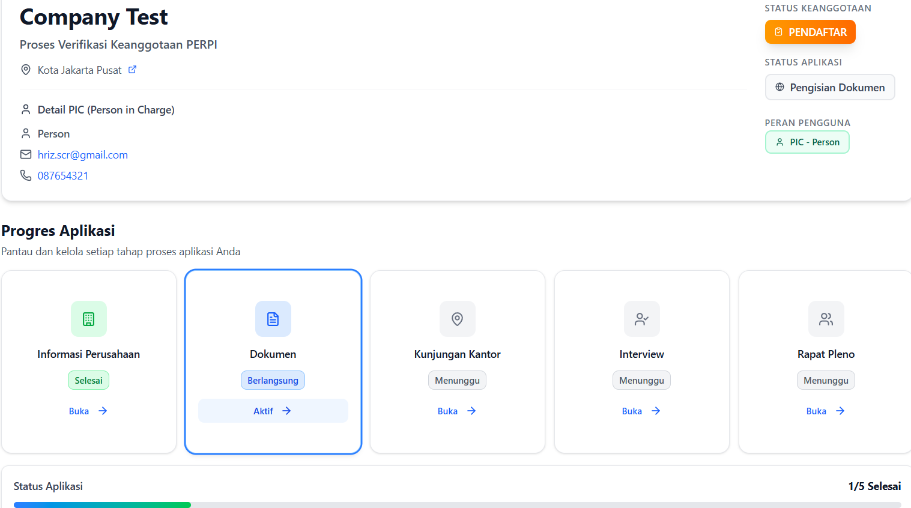

:::info Langkah Ketiga
Setelah melengkapi profil perusahaan, langkah selanjutnya adalah mengunggah dokumen-dokumen yang diperlukan untuk verifikasi keanggotaan.
:::

## Gambaran Umum

Dokumen adalah bukti legalitas dan kredibilitas perusahaan Anda. Tim PERPI akan mereview semua dokumen untuk memastikan perusahaan memenuhi persyaratan keanggotaan.

**Estimasi Waktu**: 1-2 hari (termasuk persiapan dokumen)

**Status Aplikasi**: `Pengisian Dokumen` → `Diajukan` (setelah submit)

## Daftar Dokumen yang Diperlukan

### Dokumen Wajib

Berikut adalah 11 dokumen PDF yang wajib diupload:

| No | Dokumen                                              | Deskripsi                                                                                          | Status   |
| -- | ---------------------------------------------------- | -------------------------------------------------------------------------------------------------- | -------- |
| 1  | Surat Keterangan NPWP                                | Surat keterangan Nomor Pokok Wajib Pajak (NPWP) perusahaan                                         | Wajib    |
| 2  | Akta Pendirian Perusahaan                            | Akta resmi pendirian perusahaan                                                                    | Wajib    |
| 3  | SK Kemenkumham Pengesahan Akta Pendirian             | Surat Keputusan Kemenkumham terkait pengesahan akta pendirian perusahaan                           | Wajib    |
| 4  | Akta Perubahan Terakhir                              | Dokumen akta perubahan terakhir (jika ada)                                                         | Opsional |
| 5  | SK Kemenkumham Pengesahan Akta Perubahan             | Surat Keputusan Kemenkumham terkait pengesahan akta perubahan terakhir (jika ada)                  | Opsional |
| 6  | Surat Keterangan Domisili                            | Surat keterangan domisili perusahaan                                                               | Wajib    |
| 7  | Referensi Tertulis dari Perusahaan Anggota PERPI (1) | Surat referensi atau rekomendasi dari perusahaan anggota PERPI                                     | Wajib    |
| 8  | Referensi Tertulis dari Perusahaan Anggota PERPI (2) | Surat referensi atau rekomendasi dari perusahaan anggota PERPI lainnya                             | Wajib    |
| 9  | Referensi Tertulis dari Klien                        | Surat referensi atau rekomendasi dari klien (jika ada)                                             | Opsional |
| 10 | NIB                                                  | Nomor Induk Berusaha yang masih berlaku dan mencakup kegiatan usaha KBLI 7320 (atau 73201 / 73202) | Wajib    |
| 11 | Company Profile                                      | Struktur organisasi, jumlah karyawan, alamat kantor, dan website                                   | Wajib    |
| 12 | SOP Research Operation                               | SOP mencakup working flow, data collection, dan quality assurance                                  | Wajib    |
| 13 | CV Research Director                                 | Curriculum Vitae Research Director (Full Service)                                                  | Opsional |
| 14 | CV Operation Director                                | Curriculum Vitae Operation Director (Field Ops Service)                                            | Opsional |
| 15 | Surat Pernyataan Registrasi                          | Komitmen etika riset dan standar PERPI (tersedia template)                                         | Wajib    |
| 16 | Surat Pernyataan Operasional                         | Komitmen kepatuhan dan operasional (tersedia template)                                             | Wajib    |

:::warning Penting
Semua dokumen wajib harus diupload sebelum Anda dapat submit aplikasi. Aplikasi tidak dapat disubmit jika ada dokumen wajib yang belum diupload. dokumen tidak akan tersimpan sebelum aplikasi disubmit.
:::

## Persiapan Dokumen

### Checklist Persiapan

Sebelum mulai upload, pastikan:

- [ ] Semua dokumen sudah disiapkan
- [ ] Dokumen dalam format PDF
- [ ] Dokumen terbaca dengan jelas (tidak blur)
- [ ] Ukuran file tidak terlalu besar (max 5MB per file)
- [ ] Dokumen sudah ditandatangani (untuk surat pernyataan)
- [ ] Scan dengan resolusi yang baik (minimal 150 DPI)

## Langkah 1: Akses Halaman Upload Dokumen

### Cara Mengakses

1. **Dari Dashboard**: Klik tab "Dokumen"
2. **URL**: `/applications/[companyId]` → Ini adalah url setelah login
3. **Otomatis**: Setelah simpan profil, tab Dokumen akan aktif

### Tampilan Halaman

Anda akan melihat:
- **Progress Bar**: Menunjukkan berapa dokumen yang sudah diupload
- **Daftar Dokumen**: Semua dokumen dengan status masing-masing
- **Upload Button**: Tombol untuk upload setiap dokumen

## Langkah 2: Upload Dokumen Satu Per Satu

### Proses Upload

Untuk setiap dokumen:

#### 1. Klik Tombol "Upload"
- Tombol ada di setiap card dokumen
- Dialog file picker akan muncul

#### 2. Pilih File
- Browse file PDF dari komputer Anda
- Pastikan file yang dipilih sudah benar

#### 3. Validasi File
Sistem akan memvalidasi:
- **Format**: Harus PDF
- **Ukuran**: Maksimal 5MB
- **Nama File**: Sebaiknya deskriptif

:::warning Validasi
Jika file tidak sesuai, akan muncul error:
- "File harus berformat PDF"
- "Ukuran file maksimal 5MB"
:::

#### 4. Konfirmasi Sukses
- Checkmark hijau akan muncul
- Status dokumen berubah jadi "Uploaded"
- Preview dokumen tersedia

## Langkah 3: Submisi

Setelah semua dokumen diupload dan dicek, Anda siap untuk melanjutkan ke proses submisi aplikasi.

:::warning Proses Krusial
Selama proses submisi berlangsung, mohon bersabar dan jangan menutup halaman hingga proses selesai.
Tunggu hingga persentase upload mencapai 100% untuk memastikan seluruh data tersimpan dengan benar.
:::

## Troubleshooting

### Masalah Umum

#### 1. Upload Gagal

**Error**: "Upload failed" atau "Network error"

**Penyebab**:
- Koneksi internet tidak stabil
- File terlalu besar
- Format file salah

**Solusi**:
1. Cek koneksi internet
2. Compress PDF jika terlalu besar (gunakan tools online)
3. Pastikan format PDF
4. Coba upload ulang

#### 2. File Terlalu Besar

**Error**: "Ukuran file maksimal 5MB"

**Solusi**:
1. Compress PDF dengan tools:
   - Adobe Acrobat
   - SmallPDF.com
   - iLovePDF.com
2. Kurangi resolusi scan (150 DPI cukup)
3. Hapus halaman yang tidak perlu

#### 3. Format File Ditolak

**Error**: "File harus berformat PDF"

**Solusi**:
1. Convert file ke PDF:
   - Word/Excel: Save As → PDF
   - Image: Gunakan tools convert to PDF
   - Online: PDF converter websites
2. Upload ulang file PDF

#### 4. Dokumen Tidak Muncul Setelah Upload

**Penyebab**: 
- Upload belum selesai
- Browser cache
- Session timeout

**Solusi**:
1. Tunggu beberapa detik
2. Refresh halaman
3. Cek di tab lain
4. Login ulang jika perlu

## Langkah Selanjutnya

Setelah semua dokumen diupload dan dicek, Anda siap untuk:

➡️ **[Lanjut ke: Submit Aplikasi](./03-application-submission.md)**

Di langkah selanjutnya, Anda akan:
- Melakukan final check sebelum submit
- Submit aplikasi untuk direview
- Tracking status review
- Menangani revisi (jika ada)

---