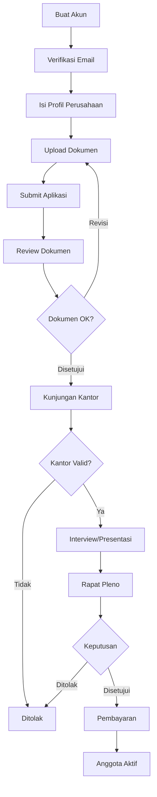

# Panduan Lengkap Anggota Baru PERPI

:::info Tentang Panduan Ini
Panduan ini menjelaskan langkah demi langkah proses menjadi anggota PERPI.
:::

## Gambaran Umum Proses

Proses menjadi anggota PERPI terdiri dari beberapa tahapan yang harus dilalui secara berurutan:

## 🔐 Sebelum Memulai

Sebelum mengikuti panduan ini, pastikan Anda sudah:
- ✅ Membuat akun dan login ke sistem
- ✅ Memahami cara menggunakan autentikasi

**Belum punya akun?** Baca dulu: **[📖 Panduan Autentikasi](../tutorial-autentikasi-perpi.md)**

---

## Daftar Panduan

### 1. [Pengisian Profil Perusahaan](./01-company-profile.md)
Melengkapi informasi perusahaan Anda:
- Data perusahaan
- Informasi PIC (Person in Charge)
- Detail operasional
- Informasi keuangan

### 2. [Upload Dokumen Persyaratan](./02-document-upload.md)
Menyiapkan dan mengunggah dokumen yang diperlukan:
- Daftar dokumen wajib
- Format dan persyaratan dokumen
- Cara upload dokumen
- Tips persiapan dokumen

### 3. [Submit Aplikasi](./03-application-submission.md)
Mengirimkan aplikasi untuk direview:
- Checklist sebelum submit
- Proses submission
- Tracking status aplikasi
- Revisi dokumen (jika diperlukan)

### 4. [Kunjungan Kantor](./04-office-visit.md)
Verifikasi lokasi dan fasilitas kantor:
- Persiapan kunjungan
- Apa yang akan diperiksa
- Dokumentasi yang diperlukan
- Tips sukses kunjungan

### 5. [Interview & Presentasi](./05-interview.md)
Presentasi profil perusahaan di kantor PERPI:
- Persiapan presentasi
- Materi yang harus dibawakan
- Format interview
- Tips presentasi yang baik

### 6. [Rapat Pleno](./06-plenary-meeting.md)
Keputusan akhir dari dewan PERPI:
- Proses rapat pleno
- Kriteria penilaian
- Notifikasi keputusan
- Langkah setelah keputusan

### 7. [Pembayaran & Aktivasi](./07-payment-activation.md)
Finalisasi keanggotaan:
- Biaya pendaftaran
- Cara pembayaran
- Konfirmasi pembayaran
- Aktivasi akun member
- Hak dan kewajiban anggota

## Persyaratan Umum

### Dokumen yang Harus Disiapkan

1. **Dokumen Perusahaan**
   - Akta Pendirian Perusahaan
   - NPWP Perusahaan
   - NIB (Nomor Induk Berusaha)
   - SIUP (jika ada)
   - Domisili Perusahaan

2. **Dokumen Operasional**
   - Company Profile
   - Struktur Organisasi
   - Daftar Klien (minimal 3)
   - Portfolio Proyek

3. **Surat Pernyataan**
   - Surat Pernyataan Registrasi
   - Surat Pernyataan Operasional

### Persyaratan Perusahaan

- Berbadan hukum (PT, CV, atau bentuk lain yang sah)
- Bergerak di bidang riset pemasaran
- Memiliki kantor operasional yang jelas
- Memiliki pengalaman minimal 1 tahun
- Memiliki minimal 3 klien aktif
- Berkomitmen pada kode etik PERPI

## Biaya Keanggotaan

| Item | Biaya |
|------|-------|
| Biaya Pendaftaran (Tahun Pertama) | Rp 7.500.000 |
| Iuran Tahunan (Tahun Berikutnya) | Rp 5.000.000 |

:::warning Penting
Biaya pendaftaran hanya dibayarkan setelah aplikasi Anda **disetujui** dalam rapat pleno. Jangan melakukan pembayaran sebelum menerima notifikasi persetujuan resmi.
:::

## Status Aplikasi

Anda dapat memantau status aplikasi Anda melalui dashboard. Berikut adalah status yang mungkin muncul:

| Status | Keterangan | Tindakan yang Diperlukan |
|--------|------------|--------------------------|
| `Mengisi Profil` | Sedang mengisi data perusahaan | Lengkapi form profil perusahaan |
| `Mengisi Dokumen` | Sedang upload dokumen | Upload semua dokumen wajib |
| `Diajukan` | Aplikasi telah disubmit | Tunggu review dari tim PERPI |
| `Sedang Ditinjau` | Tim sedang mereview dokumen | Tidak ada, tunggu hasil review |
| `Menunggu Revisi` | Dokumen perlu diperbaiki | Perbaiki dokumen sesuai catatan |
| `Kunjungan Kantor` | Menunggu jadwal kunjungan | Koordinasi jadwal dengan inspector |
| `Interview` | Menunggu jadwal presentasi | Persiapkan materi presentasi |
| `Rapat Pleno` | Menunggu keputusan rapat | Tunggu notifikasi keputusan |
| `Disetujui` | Aplikasi disetujui | Lakukan pembayaran |
| `Ditolak` | Aplikasi ditolak | Lihat alasan penolakan |

## Bantuan dan Dukungan

### Kontak PERPI

- **Email**: info@perpi.or.id
- **Telepon**: (021) xxxx-xxxx
- **Alamat**: [Alamat Kantor PERPI]

### FAQ (Frequently Asked Questions)

**Q: Berapa lama proses persetujuan keanggotaan?**
A: Rata-rata 2-3 bulan dari submit aplikasi hingga keputusan akhir.

**Q: Apakah bisa mengajukan kembali jika ditolak?**
A: Ya, Anda dapat mengajukan kembali setelah memperbaiki hal-hal yang menjadi alasan penolakan.

**Q: Dokumen apa yang paling sering ditolak?**
A: Biasanya Company Profile yang kurang lengkap atau Surat Pernyataan yang tidak sesuai format.

**Q: Apakah harus memiliki kantor fisik?**
A: Ya, salah satu persyaratan adalah memiliki kantor operasional yang akan diverifikasi melalui kunjungan.

**Q: Bagaimana jika ada perubahan data setelah submit?**
A: Hubungi tim PERPI melalui email atau telepon untuk update data.

## Tips Sukses

1. **Persiapkan Dokumen dengan Baik**
   - Pastikan semua dokumen lengkap dan sesuai format
   - Gunakan file PDF untuk dokumen resmi
   - Pastikan dokumen terbaca dengan jelas

2. **Isi Data dengan Akurat**
   - Periksa kembali semua data sebelum submit
   - Pastikan nomor telepon dan email aktif
   - Gunakan data yang konsisten di semua dokumen

3. **Responsif terhadap Komunikasi**
   - Cek email secara berkala
   - Balas komunikasi dari tim PERPI dengan cepat
   - Siapkan diri untuk jadwal kunjungan dan interview

4. **Persiapkan Presentasi dengan Matang**
   - Buat company profile yang menarik
   - Siapkan portfolio terbaik
   - Latih presentasi sebelum hari H

5. **Tunjukkan Komitmen**
   - Pahami kode etik PERPI
   - Tunjukkan keseriusan dalam proses
   - Berpartisipasi aktif dalam setiap tahapan

---