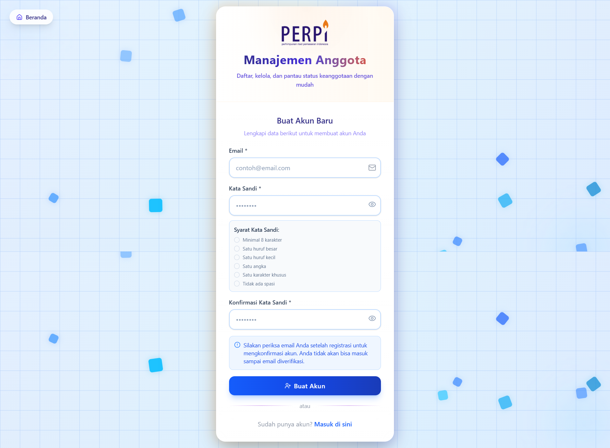
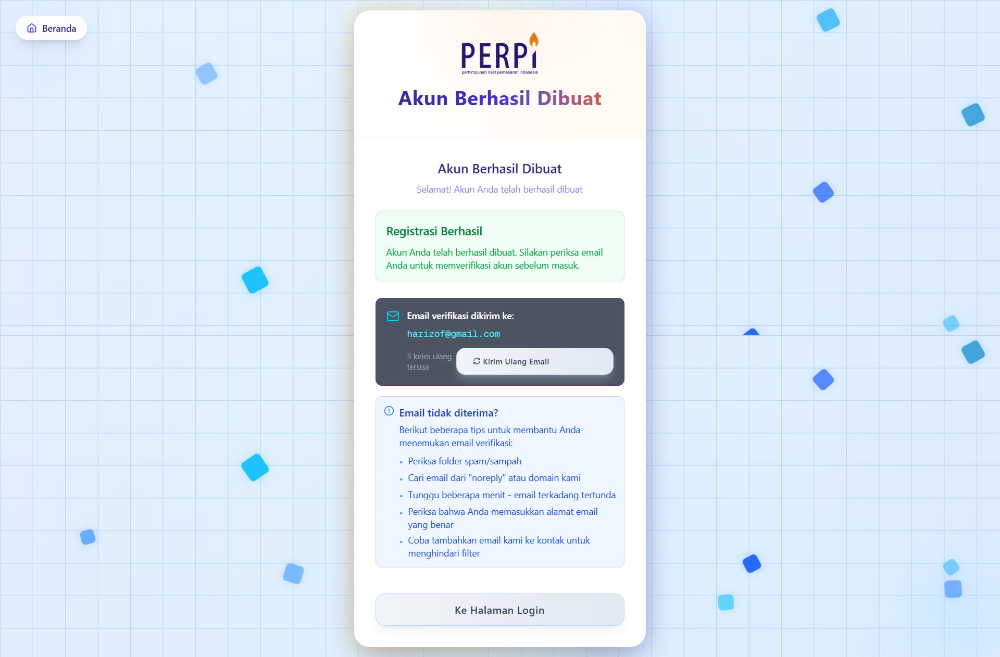

# Tutorial Sistem Autentikasi PERPI

:::info Tentang Tutorial Ini
Tutorial ini menjelaskan cara menggunakan sistem autentikasi lengkap pada [aplikasi Member PERPI](http://member.perpi.id/), termasuk login, registrasi, reset password, manajemen pengguna, dan kontrol akses berdasarkan peran.
:::

## Daftar Isi

1. [Login (Masuk)](#login-masuk)
2. [Registrasi (Daftar Akun Baru)](#registrasi-daftar-akun-baru)
3. [Lupa Password](#lupa-password)
4. [Floating Button Manajemen Pengguna](#floating-button-manajemen-pengguna)
5. [Pembuatan Pengguna oleh Leader](#pembuatan-pengguna-oleh-leader)
6. [Sistem Peran dan Kontrol Akses](#sistem-peran-dan-kontrol-akses)

---

## Login (Masuk)

### Cara Mengakses Halaman Login

1. Buka [aplikasi Member PERPI](http://member.perpi.id/) di browser
2. Jika belum login, Anda akan diarahkan ke halaman login secara otomatis
3. Atau akses langsung melalui URL: https://member.perpi.id/auth/login

### Proses Login

1. **Masukkan Email**: Ketik alamat email yang terdaftar
2. **Masukkan Password**: Ketik kata sandi Anda
3. **Klik Tombol "Masuk"**: Sistem akan memverifikasi kredensial Anda

### Fitur Login

- **Toggle Password**: Klik ikon mata untuk menampilkan/menyembunyikan password
- **Validasi Real-time**: Form akan menampilkan error jika ada kesalahan
- **Redirect Otomatis**: Setelah login berhasil, Anda akan diarahkan ke dashboard sesuai peran

### Pesan Error Umum

| Error | Penyebab | Solusi |
|-------|----------|--------|
| "Invalid login credentials" | Email/password salah | Periksa kembali email dan password |
| "Email not confirmed" | Email belum diverifikasi | Cek email untuk link verifikasi |

---

## Registrasi (Daftar Akun Baru)

### Cara Mengakses Halaman Registrasi

1. Dari halaman login, klik link "Buat Akun Baru"
2. Atau akses langsung melalui URL: https://member.perpi.id/auth/signup

### Proses Registrasi

1. **Isi Form Registrasi**:
   - Email (wajib)
   - Password (minimal 8 karakter)
   - Konfirmasi Password

2. **Validasi Password**: Sistem akan menampilkan aturan password:
   - Minimal 8 karakter
   - Mengandung huruf besar
   - Mengandung huruf kecil
   - Mengandung angka
   - Mengandung karakter khusus

3. **Klik "Buat Akun"**: Sistem akan mengirim email verifikasi

### Verifikasi Email

Setelah registrasi berhasil:

1. **Cek Email**: Buka kotak masuk email Anda
2. **Klik Link Verifikasi**: Klik link yang dikirim oleh sistem
3. **Konfirmasi**: Akun Anda akan aktif setelah verifikasi

:::warning Penting
Akun baru memiliki peran "member" secara default. Untuk peran lain (leader, committee, finance), hubungi administrator.
:::

### Kirim Ulang Email Verifikasi

Jika tidak menerima email:

1. Klik tombol "Kirim Ulang Email Verifikasi"
2. Tunggu cooldown period (60 detik)
3. Periksa folder spam/junk

---

## Lupa Password

### Cara Reset Password

1. **Akses Halaman Reset**: Dari halaman login, klik "Lupa kata sandi?"
2. **Masukkan Email**: Ketik email yang terdaftar
3. **Klik "Kirim Email Reset"**: Sistem akan mengirim link reset

### Proses Reset Password

1. **Cek Email**: Buka email reset password
2. **Klik Link Reset**: Klik link yang dikirim sistem
3. **Buat Password Baru**: Anda akan diarahkan ke halaman update password

### Tips Keamanan Password

- Gunakan kombinasi huruf besar, kecil, angka, dan simbol
- Minimal 8 karakter
- Jangan gunakan informasi pribadi
- Gunakan password yang unik untuk setiap akun

---

## Floating Button Manajemen Pengguna

### Lokasi dan Tampilan

Floating button manajemen pengguna muncul di pojok kanan bawah layar pada semua halaman (kecuali halaman auth).

### Fitur Floating Button

1. **Informasi Pengguna**:
   - Nama lengkap
   - Email
   - Badge peran (Leader/Committee/Member)

2. **Menu Aksi**:
   - **Kelola Akun**: Menuju halaman user management
   - **Logout**: Keluar dari sistem

---

## Pembuatan Pengguna oleh Leader

### Akses Halaman User Management

Hanya pengguna dengan peran **Leader** yang dapat membuat pengguna baru.

1. **Login sebagai Leader**
2. **Akses Menu**: Navigasi ke https://member.perpi.id/leader/users
3. **Klik "Add New User"**: Tombol biru di pojok kanan atas

### Proses Pembuatan Pengguna

1. **Buka Dialog**: Klik tombol "Add New User"
2. **Isi Form**:
   - **Full Name**: Nama lengkap pengguna
   - **Email**: Alamat email (harus unik)
   - **Role**: Pilih peran (Leader/Committee/Finance/Member)

3. **Klik "Create User"**: Sistem akan membuat akun otomatis

### Hasil Pembuatan Pengguna

- Sistem membuat password kuat dan rahasia (tidak ditampilkan).
- Pengguna baru harus reset password melalui halaman Lupa Kata Sandi.
- Admin hanya melihat pesan: "User created successfully"

---

## Sistem Peran dan Kontrol Akses

### Hierarki Peran

### Deskripsi Peran

#### 1. Leader (Pemimpin)
- **Akses Penuh**: Semua fitur dan halaman
- **Manajemen Pengguna**: Dapat membuat, edit, hapus pengguna
- **Approval**: Menyetujui aplikasi keanggotaan
- **Dashboard**: https://member.perpi.id/leader

#### 2. Committee (Komite)
- **Manajemen Aplikasi**: Review dan proses aplikasi
- **Inspeksi**: Melakukan kunjungan kantor
- **Dashboard**: https://member.perpi.id/committee

#### 3. Finance (Keuangan)
- **Manajemen Pembayaran**: Kelola iuran tahunan
- **Invoice**: Buat dan kelola tagihan
- **Dashboard**: https://member.perpi.id/finance

#### 4. Member (Anggota)
- **Aplikasi Keanggotaan**: Submit dan track aplikasi
- **Profil Perusahaan**: Kelola data perusahaan
- **Dashboard**: https://member.perpi.id/member atau https://member.perpi.id/application

### Kontrol Akses Halaman

| Halaman | Leader | Committee | Finance | Member |
|---------|--------|-----------|---------|--------|
| `/leader/*` | ✅ | ❌ | ❌ | ❌ |
| `/committee/*` | ✅ | ✅ | ❌ | ❌ |
| `/finance/*` | ✅ | ❌ | ✅ | ❌ |
| `/member/*` | ✅ | ❌ | ❌ | ✅ (own data) |
| `/applications/*` | ✅ | ✅ | ❌ | ✅ (own data) |

### Redirect Otomatis

Sistem secara otomatis mengarahkan pengguna ke dashboard yang sesuai:

1. **Setelah Login**: Redirect ke dashboard sesuai peran
2. **Akses Terlarang**: Redirect ke dashboard yang diizinkan
3. **URL Langsung**: Validasi akses sebelum menampilkan halaman

### Status Keanggotaan Member

Member memiliki status keanggotaan yang mempengaruhi akses:

| Status | Akses | Keterangan |
|--------|-------|------------|
| `applicant` | `/applications/{id}` | Sedang proses aplikasi |
| `active_member` | `/company/{id}` | Anggota aktif |
| `inactive_member` | `/member/{id}/payment` | Perlu bayar iuran |

---

## Tips dan Best Practices

### Keamanan Akun

1. **Password Kuat**: Selalu gunakan password yang kompleks
2. **Logout**: Selalu logout setelah selesai menggunakan aplikasi
3. **Browser**: Jangan simpan password di browser publik
4. **Sharing**: Jangan bagikan kredensial login

### Troubleshooting Umum

#### Tidak Bisa Login
1. Refresh halaman setelah login
2. Periksa email dan password
3. Cek apakah email sudah diverifikasi
4. Coba reset password jika lupa
5. Hubungi administrator jika masih bermasalah

#### Tidak Menerima Email
1. Periksa folder spam/junk
2. Pastikan email address benar
3. Tunggu beberapa menit
4. Coba kirim ulang email

#### Akses Ditolak
1. Periksa peran akun Anda
2. Pastikan mengakses halaman yang sesuai
3. Hubungi leader untuk upgrade peran jika diperlukan

:::info Bantuan Lebih Lanjut
Jika mengalami masalah yang tidak tercantum dalam tutorial ini, hubungi administrator sistem atau leader organisasi untuk mendapatkan bantuan.
:::